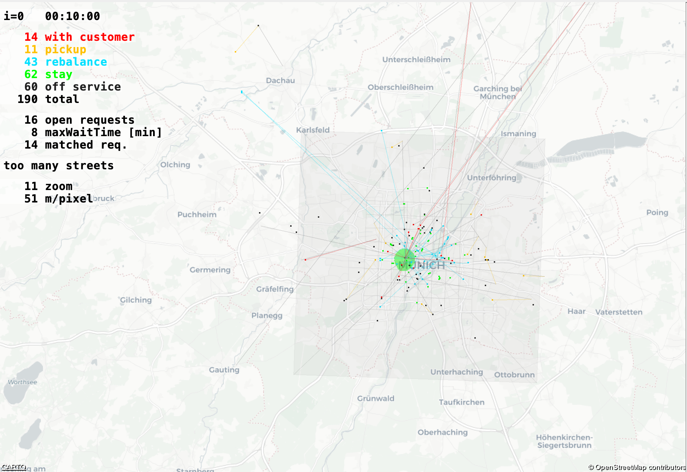

# Amodeus Munich Taxi

Simulation Model used in the thesis "Predictive Fleet Strategy for Ridesourcing Services in Reference to Munich's Taxi System" (2022) by Michael Wittmann, M. Sc. at the Institute of Automotive Technology (FTM) at Technical University Munich (TUM).

This repository contains all necessary source code for simulating different distribution and rebalancing strategies
for the Munich taxi traffic.
The simulation uses the [Amodeus](https://github.com/idsc-frazzoli/amodeus) (version 2.0.0) library as a base simulation framework.
Because the Amodeus library is not perfect in its current state a copy of the library is included
in this repository and was modified.
It is recommended to follow the tutorials and documentation provided at [Amodeus Science](https://www.amodeus.science) before starting to work on this project.


## Project structure
Because the simulation uses a slightly modified copy of the original Amodeus library instead of the official one the `pom.xml` of the `amod`
module was adapted to use the `de.tum.ftm.amodeus.{version}` variant of the library. The module `amodeus` builds this
library. So every time you make changes inside the `amodeus` module, or you want to simulate for the first time,
you should run `mvn clean install` inside the `amodeus` directory.

Alternatively, you can also run `mvn clean install` in the top-level directory. This command first installs the `amodeus`
module followed by the `amod` module.

## Getting started

### Prerequisites
Please make sure you have the following Software installed.

- IntelliJ IDE (Optional but recommended)
- Java SE Development Kit (version 8, or above)
- Apache Maven
- GLPK and GLPK for Java (Ensure you install compatible versions, e.g. [here](http://glpk-java.sourceforge.net/gettingStarted.html))
  - Prerequisites are: GCC, Libtool, Swig, and Subversion
- [Gurobi](https://www.gurobi.com/products/gurobi-optimizer/whats-new-current-release/) 9.1.2 
- Docker (Optional)

### Run the Example
Clone the source from GitHub
```
git clone https://github.com/TUMFTM/amodeus-munich-taxi.git
```
Go into the project directory
```
cd amodeus-munich-taxi
```
Run maven install
```
mvn clean install -DskipTests=true
```
Run maven package
```
mvn package install -DskipTests=true
```
Go to the example scenario
```
cd amod/scenarios/munich_example
```
Run Simulation
```
munich_example % java -Djava.library.path=/usr/local/lib/jni -cp ../../target/amod-2.0.0-SNAPSHOT.jar de.tum.mw.ftm.amod.taxi.ScenarioExecutionSequence
```

After the simulation is done you'll find all the generated results in the `/output` directory of your scenario. 
A simplified summary of the most important results can be found in `output/<SIM_RUN>/data/PythonExport`

To analyze and plot your results you can use a basic set of analysis scripts provided `python-utils/simulation_analysis` [Link](python-utils/simulation_analysis)

## Run your Simulation

### Required Inputs
To run the simulation you need to provide the following input files (examples for the Munich Usecase can be found in [scenarios/munich_example](amod/scenarios/munich_example):

- `AmodeusOptions.properties`: Amodeus root properties, defines the path of the Matsim configuration
- `conifg_template.xml`: The Matsim config file used for the simulation. Specifies most of the data source files and simulation parameters
- `dynamic_fleet_size.xml`: Defines the time-variant target fleet size
- `linkSpeedData`: Defines the time-variant target speeds per network link and generated based on real-world observations.
- `LPOptions.properties`: Property file for amoedus linear optimization dispatchers
- `preperedNework`: Street network used for the simulation.
- `rawPopulation`: Travel demand file (Containing departure times and OD information)
- `taxiRanks.xml`: Locations of Taxi Ranks

The generation of the specified Input files may highly depend on your source dataset. As the Munich taxi dataset is not publicly available the related generation procedures are not part of this repository. 

To implement your generators based on your need you can follow the structure of `de.tum.mw.ftm.amod.taxi.ScenarioPreparer.java` or check the individual
scripts to generate the required input files under [Preprocessing](amod/src/main/java/de/tum/mw/ftm/amod/taxi/preprocessing).
Make sure to run the scripts in the working directory that contains your scenario.

### Additional Dispatchers
#### ReferenceDispatcher: 
Reference model based on the rebalancing and dispatching behavior of the Munich taxi fleet.
##### Configuration:
```XML
<module name="amodeus">
...
<parameterset type="dispatcher">
    <param name="type" value="ReferenceDispatcher"/>
    <param name="distanceHeuristics" value="EUCLIDEAN"/>
</parameterset>
...
</module>
 ```
##### Required Inputs:
- `dispatchingZones.xml`: Defines the dispatching zones used in the real world `ReferenceDispatcher`

#### RebalancingLPDispatcher: 
Predictive profit maximizing dispatching logic based on [T. Oda und C. Joe-Wong, 2018](https://doi.org/10.1109/infocom.2018.8485988) and extended in [Wittmann et. al 2020](https://doi.org/10.3390/electronics9061021)
##### Configuration:
```XML
<module name="ftm_simulation">
  ...
  <param name="alpha" value="0.1855"/>
  <!-- Lambda value only used on the RebalncingLPDispatcher  -->
  <param name="lambda" value="12.26"/>
  ...
</module>
...
<module name="amodeus">
...
<parameterset type="dispatcher">
  <param name="type" value="RebalancingLPDispatcher"/>
  <param name="distanceHeuristics" value="EUCLIDEAN"/>
</parameterset>
...
</module>
```
##### Required Inputs:
- `predictions.xml`: Demand predictions generated by an external prediction model. To transform predictions made with [mod-prediction-framework](https://github.com/TUMFTM/mod-prediction-framework) you can use the python script provided [here](python-utils/demand_prediction/demand_prediction_utils.py).
- `target_probabilities`: Target Probabilites for OD realtions (time variant)
- This dispatcher requires that `gurobi` add the library path to your runtime configuration. E.g. `--Djava.library.path=/Library/gurobi912/macos_universal2/lib:/usr/local/lib/jni`

## Known Issues
**2021-03-12 | @michaelwittmann**:\
The basic concept of vehicle tasks was modified, to provide a faster and more flexible Analysis.
It was tested against all non-shared dispatchers. If you plan to use shared dispatchers you need to adapt the class `AdaptMenuDirective`.
All amodeus tests with shared dispatchers were uncommented.

## Contributors
- [Michael Wittmann](https://github.com/michaelwittmann)
- [Maximilian Speicher](https://github.com/maxispeicher)
- Lorenz Neuner
- [Nanda Teuffel](https://github.com/NandaYogeshwar)

## Related Publications

- M. Wittmann, L. Neuner und M. Lienkamp, „A Predictive Fleet Management Strategy for On-Demand Mobility Services: A Case Study in Munich,“ Electronics, Bd. 9, Rn. 6, S. 1021, 2020, DOI: [10.3390/electronics9061021](https://doi.org/10.3390/electronics10040379)
- M. Wittmann, M. Kollek und M. Lienkamp, „Event-driven anomalies in spatiotemporal taxi passenger demand,“ in 2018 21st Int. Conf. Intell. Transp. Syst. 2018, S. 979–984, DOI: [10.1109/ITSC.2018.8569500](https://doi.org/10.1109/ITSC.2018.8569500)
- B. Jäger, M. Wittmann und M. Lienkamp, „Analyzing and Modeling a City’s Spatiotemporal Taxi Supply and Demand: A Case Study for Munich,“ J. Traffic Logist. Eng., Bd. 4, Rn. 2, S. 147–153, 2016, DOI: [10.18178/jtle.4.2.147-153](https://doi.org/10.18178/jtle.4.2.147-153)
- M. Wittmann. „custom-osm-maps-mit-osmium,“ 2019. Available at: https://smarte-mobilitaet-blog.ftm.mw.tum.de/index.php/2019/09/23/custom-osm-maps-mit-osmium/.
- B. Jäger, M. Wittmann und M. Lienkamp, „Agent-based Modeling and Simulation of Electric Taxi Fleets,“ in 6. Conf. Futur. Automot. Technol. 2017, S. 11–47.

## Citation
If you find our work useful in your research, please consider citing:
```Latex
@phdthesis {
	author = "Wittmann, Michael",
	title = "Prädiktive Flottenstrategie für Ridesourcing-Dienste am Beispiel des Münchner Taxiverkehrs",
	type = "Dissertation",
	school = "Technische Universität München",
	address = "München",
	year = 2022
}
```
